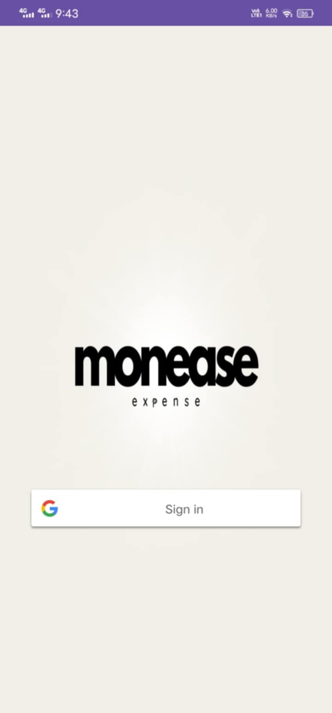
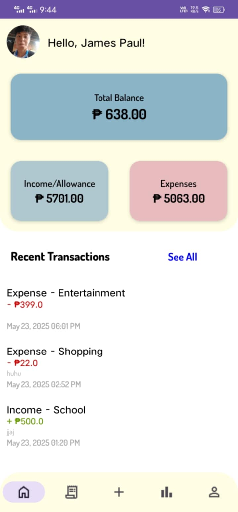
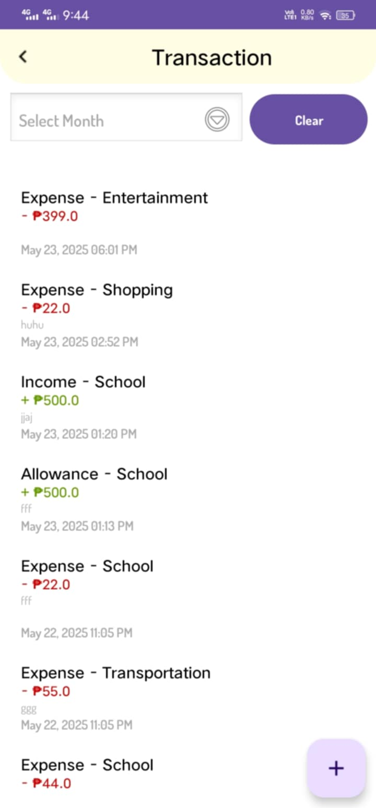
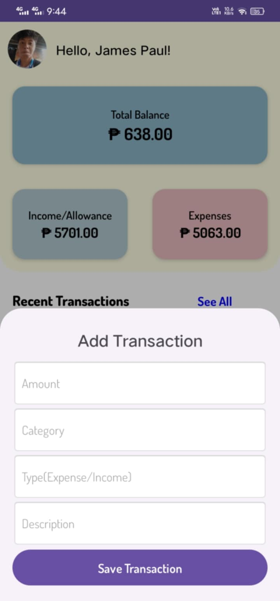
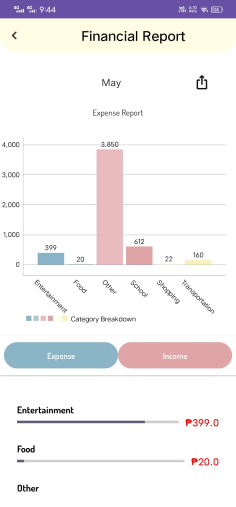
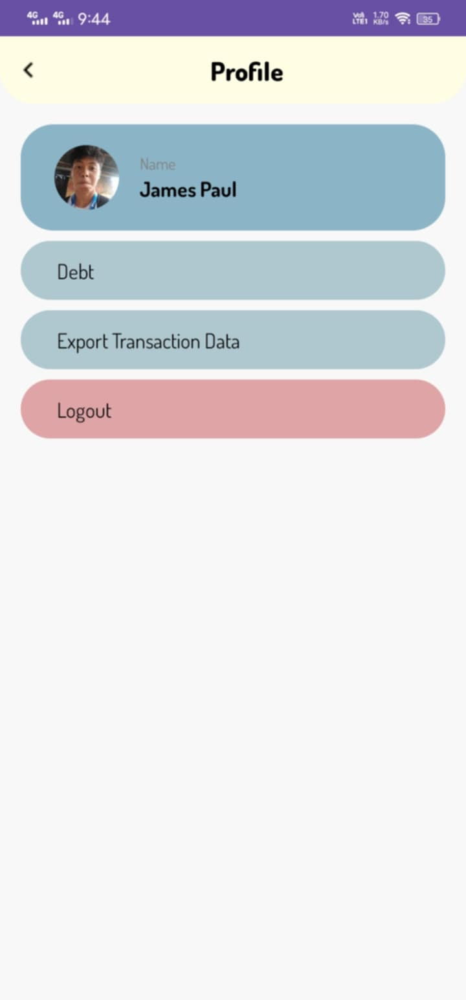
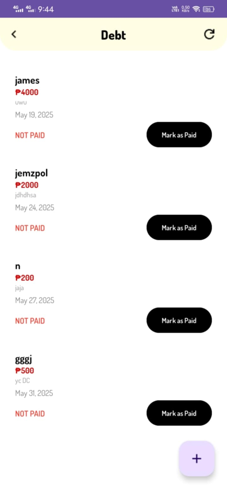

# Monease Expense Tracker

> Monease App will track your expenses.

## Features
- Add transaction
- Add debt
- Can view transaction with graph and text
- Can export data

## Tech Stack

##  UI Screenshots
| Login Screen | Home Screen |
|-------------|----------------|
|  |  |

| Transaction Screen | Add Transaction Screen |
|-------------|----------------|
| |  |

| Report | Profile Screen |
|-------------|----------------|
|  |  |

|Debt Screen|              |
|-------------|-------------|
|  |

### Download the APK
[Click here to download the app](https://github.com/james-paul25/monease-expense-app/tree/main/apk/monease.apk)

